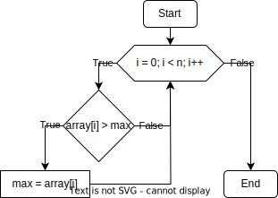

# НИЯУ МИФИ. Лабораторная работа №1. Нестеренко Виталий, Б21-525. 2023

## Используемая система

### Операционная система
Windows 10 LTSC 21H2

### Процессор
Intel Xeon E5-2666v3
```text
Total Cores: 10
Total Threads: 20
Processor Base Frequency: 2.90 GHz
Max Turbo Frequency: 3.50 GHz
L1 cache: 32 KB per core
L2 cache: 256 KB per core
L3 cache: 25 MB
```

### Оперативная память
```text
Memory Type: DDR4
SPD Speed: 2133MHz
Memory Size: 32 GB
```

## Используемый алгоритм

### Принцип работы
Данный алгоритм проходит по массиву чисел и сравнивает их с текущим максимумом для данного потока. Если элемент оказывается больше, то в переменную **max** записывается значение этого элемента. После выполнения итерационной части потока, полученное внутри потока значение **max** сравнивается с **max** из **shared** области, после чего из них выбирается наибольший. Таким образом, наибольший элемент будет в **max** из **shared** области

Алгоритм использует директивы OpenMP, чтобы сделать вычисления параллельными и полностью нагрузить процессор

### Блок схема


## Файлы docker 
### Dockerfile
```text
FROM alpine                                                 # Используем образ alpine
RUN apk update && apk add g++ git                           # Устанавливаем g++ и git

WORKDIR /parvpo                                             # Используем /parvpo в качестве рабочей директории

RUN git clone https://github.com/vit6556/parvpo git         # Клонируем репозиторий
RUN cd git/lab1 && g++ -fopenmp -o lab1.out lab1.cpp        # Компилируем программу
RUN mkdir results                                           # Создаем папку для результатов
```
### docker-compose.yml
```text
version: "3"

services:
  lab1:                                                                 
    container_name: lab1
    build: .                                                            # Собираем образ
    command: /bin/sh -c "./git/lab1/lab1.out > results/output.txt"      # Запускаем программу и перенаправляем вывод в файл
    volumes:                                                            # Подключаем volume для сохранения результатов
      - ./results:/parvpo/results
```
## Результаты
### Сравнение работы алгоритма на хост-машине и в docker

Алгоритм был запущен 10 раз как в Docker, так и на хост-машине, после чего были рассчитаны средние значения времени его работы и потребления системных ресурсов

#### Время работы
```text
Хост-машина: 30.61 сек
Docker: 30.77 сек
```

Запуск алгоритма внутри контейнера увеличил время работы на ~0.52%

#### Потребление оперативной памяти
```text
Хост-машина: 7635 мб
Docker: 7645 мб
```
Запуск алгоритма внутри контейнера увеличил потребление оперативной памяти на ~0.13%

### Вывод
Запуск алгоритма в контейнере незначительно увеличивает время его работы и потребление оперативной памяти, но эти различия настолько малы, что их можно списать на погрешность измерений. Единственная значимая разница во времени работы заключается во времени, затрачиваемом на сборку образа контейнера